<p align="center">
  <a href="">
    
  </a>
  <h4 align="center">Intuitive, customizable Dog Matching App</h4>
  <p align="center">
    <a href="https://fetch-take-home-rcervant.vercel.app/"><strong>Product Website »</strong></a>
    <br><br>
    <a href="https://github.com/rcervant/fetch-take-home">
      
    </a>
    <a href="https://github.com/rcervant/fetch-take-home/issues">
      
    </a>
    
    <br>
    <a href="https://github.com/rcervant/fetch-take-home/stargazers">
      
    </a>
  </p>
</p>

---

## Table of Contents 🗺️

- [About the Dog Matching App](#about)
- [Features](#features)
- [Getting Started](#getting-started)


---

<a name="about"></a>

## About the Dog Matching App 📙

The Dog Matching App is designed to help you find your perfect furry companion. We understand the importance of finding the right dog for your lifestyle, and that's why we've created this intuitive, customizable app.

With the Dog Matching App, you can:

- Easily browse and search for available dogs.
- Filter dogs by breed, age, and more.
- Save your favorite dogs for future reference.
- Generate a match with a single dog using our advanced algorithm.
- Find dogs within a 25km radius of your current location.

We're committed to making dog adoption a seamless and enjoyable experience. Get started today and find the dog of your dreams!

---

<a name="features"></a>

## Core Features 😊

### Easy-to-Use Interface ✅

Our user-friendly interface makes finding your perfect dog a breeze. With intuitive search and filter options, you can quickly discover dogs that match your criteria.

### Comprehensive Dog Profiles 🔎

Each dog's profile is packed with valuable information, including breed, age, size, and more. We provide clear and detailed profiles to help you make the right choice.

### Favorite Dogs 🐾

Save your favorite dogs to a personalized list for easy access. Our app stores your favorites so that you can revisit them at any time.

### Intelligent Matchmaking 🧡

Our advanced matching algorithm considers your preferred pups and finds the perfect dog for you. 

### Nearby Dogs 🌍

Discover furry friends within a 25km radius of the current dog for potential playdates.

---

<a name="getting-started"></a>

## Getting Started with the Dog Matching App ⬆️

Getting started with the Dog Matching App is simple. Just follow these steps:

### 1. Install Dependencies

Make sure you have Node.js (v18.7+) installed on your machine. Then, proceed to install the project dependencies by running the following command:

```bash
npm install
```

Before running the app, you'll need to set up a few configuration files:

- **`.env.local`**: This file contains Next.js-specific environment variables.
- **`.env`**: Prisma relies on this file to access the database URL.
- **`.env.template` (provided)**: Contains variables needed for both **`.env.local`** and **`.env`**.

Create duplicate copies of **`.env.template`** and name them **`.env.local`** and **`.env`**. Fill in the required information in these files.

#### .env.local
```bash
NEXT_PUBLIC_ORIGIN = "http://localhost:3000"
NEXT_PUBLIC_FETCH_COOKIE_NAME=<FOUND IN EXERCISE INSTRUCTIONS>
NEXT_PUBLIC_FETCH_API_URL=<FOUND IN EXERCISE INSTRUCTIONS>
```
#### .env
```bash
DATABASE_URL=
```
### 2. Setting Up the Database

You have two options for setting up the database:

#### [1] Local Setup with Docker

- Start by installing Docker Desktop (macOS/windows) or Docker Engine (Linux). [Install Docker](https://www.docker.com/get-started/)

- Run the following command in a new terminal to initialize the Docker container with a MySQL database:

**macOS/Linux**
```bash
  npm run db:init
```
   **Windows**
```bash
  npm run db:init-win
```

Now, you have a MySQL database running in a Docker container with the following credentials:

- Database name: my_db
- Database password: password
- Port exposed: 3306

To connect to the database with Prisma, run the following command in a new terminal:
```bash
npm run prisma:init
```
#### [2] Local Setup with a Cloud Provider

You can also run the app locally with a MySQL database provided by a cloud service like [PlanetScale](https://planetscale.com/docs/tutorials/planetscale-quick-start-guide) or [Railway](https://docs.railway.app/databases/mysql). Replace the **`DATABASE_URL`** in **`.env`** with the URL provided by the cloud provider.

```bash
npm run prisma:init
```

### 3. Running the App

You're now ready to run the app:
```bash
npm run dev
```
The app will be accessible at [http://localhost:3000](http://localhost:3000/) in your web browser.

---

## User Guide

Let's explore the key features of the Dog Matching App:

### Login Page

- Start by logging in with your name and email to access the app.

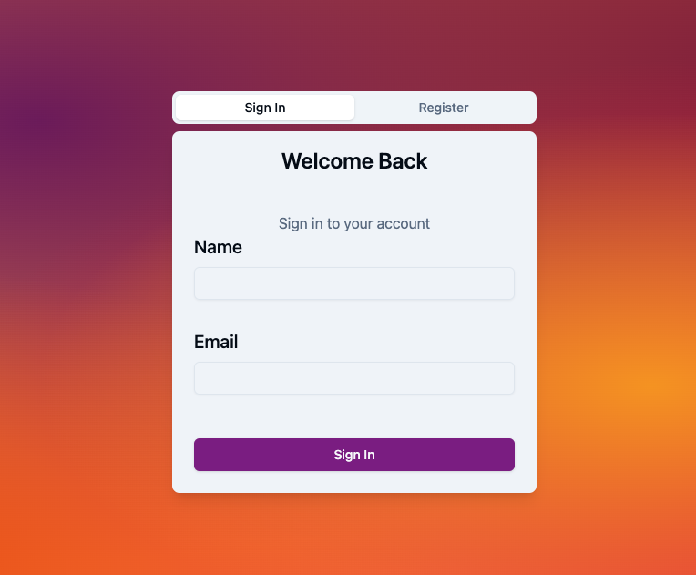

### Search Page

- Explore and search for available dogs.

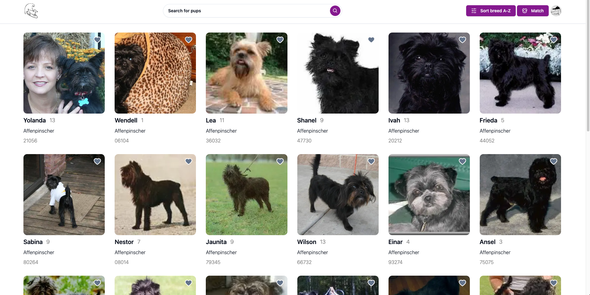

- Enjoy support for result pagination with infinite scrolling.

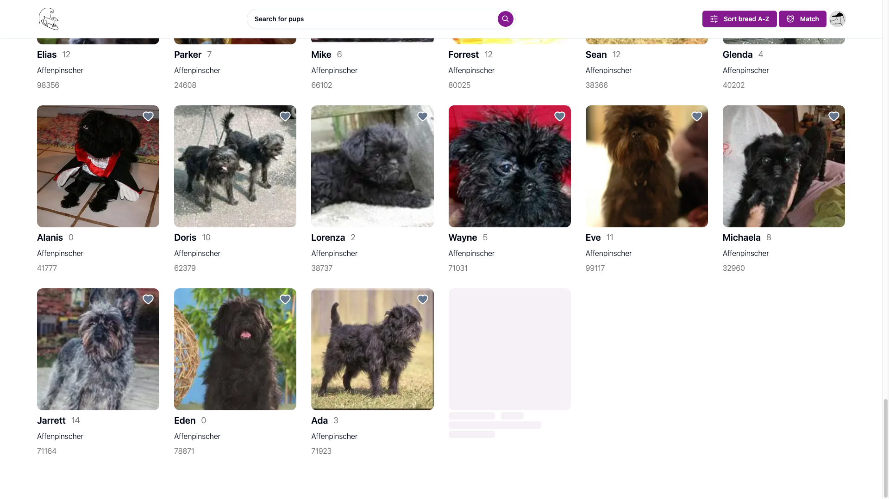

- Filter dogs by breed.

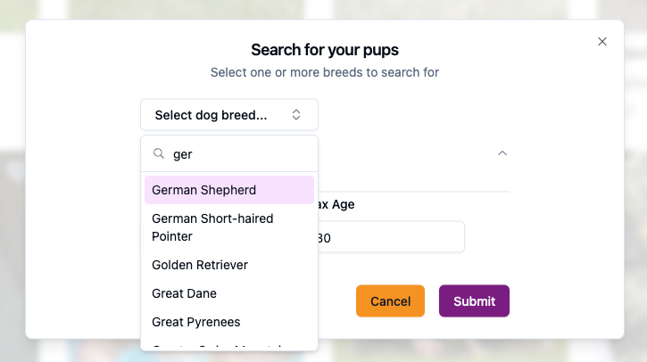
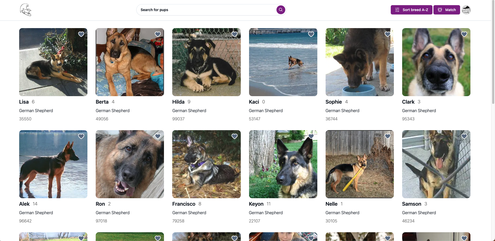

- Sort results alphabetically by breed, with options for ascending or descending.

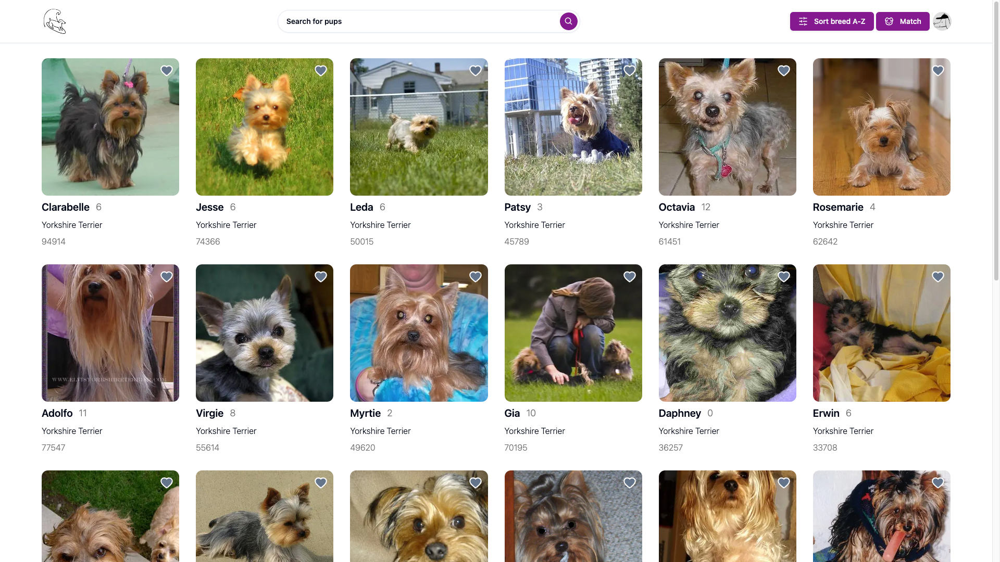

### Favorite Dogs

- Save your favorite dogs for future reference and to generate matches. Favorites save across sessions.

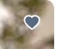
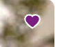

### Dog Page

- View detailed information about individual dogs.

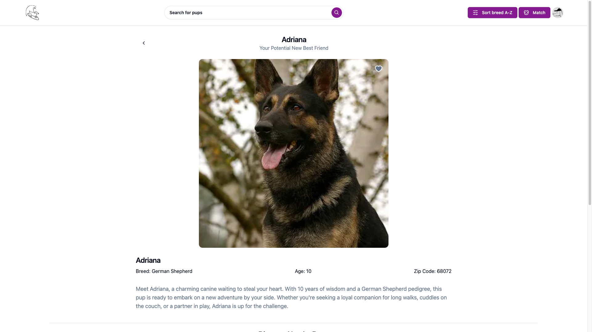

### Favorite Dogs Page

- Access a comprehensive list of your favorited dogs.
- Save your favorite dogs for future reference.

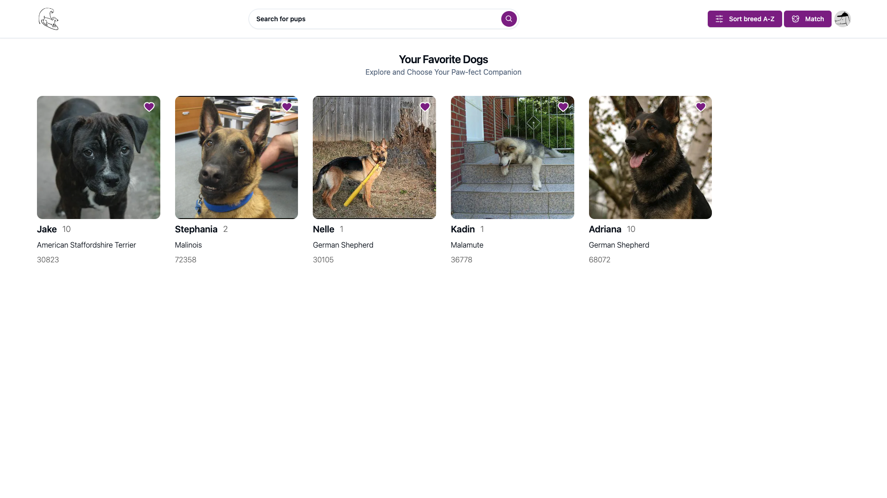

### Match Page

- Generate a match with a single dog using the **`match`** button.

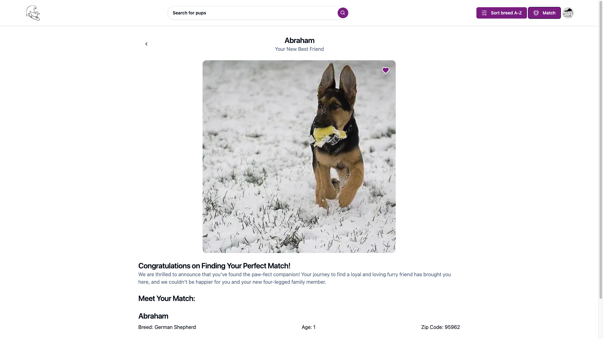

### Logout

- Logout when you've finished using the app from the user menu in the top right corner.

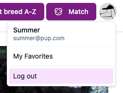

## Extra Features

Explore these advanced features:

### Nearby Dogs

- Find dogs within a 25km radius of the current dog.

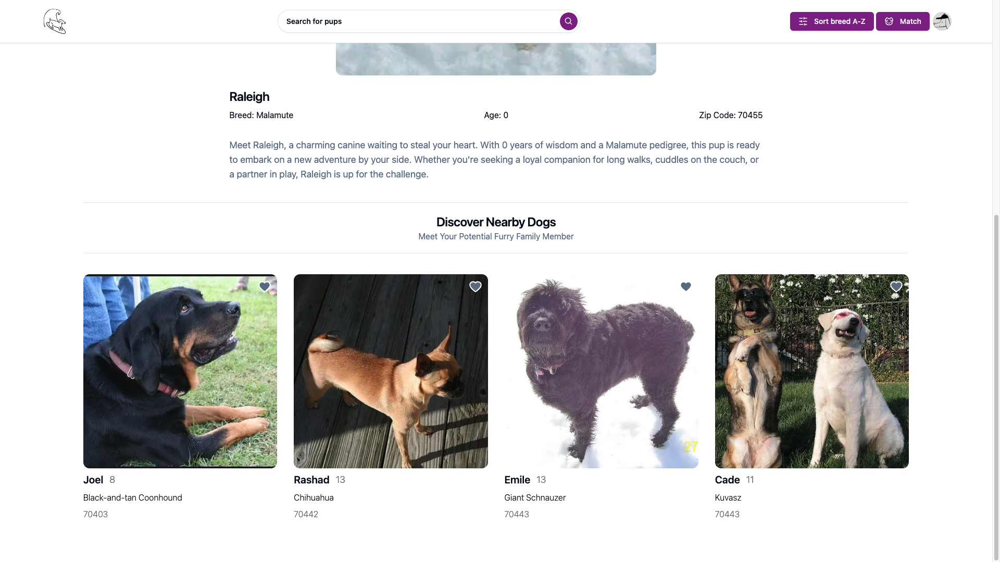

- Utilize additional filters for age and multiple breeds.

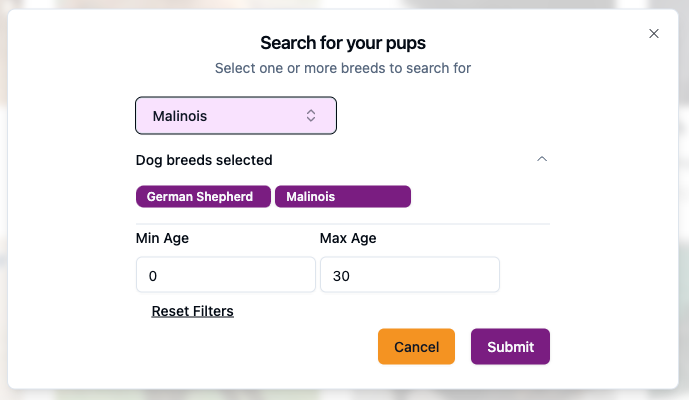

## Latest and Greatest

This Dog Matching App boasts the latest technologies and features:

- Developed with Next.js 13 and React Server Components.
- Hosted on Vercel for seamless deployment and scaling.
- Utilizes a database for data persistence across sessions and devices.
- Prioritizes responsive design for various devices.
- Implements accessibility features to reach a wide audience.
- Optimizes performance with cached API calls using Next.js.
- Connects to the database using Prisma for efficient data management.
- Utilizes Docker for easy deployment and containerization.
- Stylishly designed using Tailwind CSS.
- Modularized components for easier maintenance and extendibility.
- Custom React hooks for efficient functionality and readability.
- Server-side API calls with Next.js server actions.
- Sleek UI components from [shadcn/ui](https://ui.shadcn.com/docs).
- All pages include loading and error states for a smooth user experience.

---