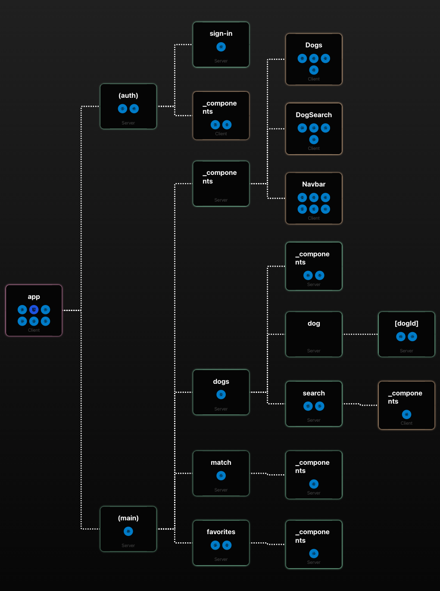
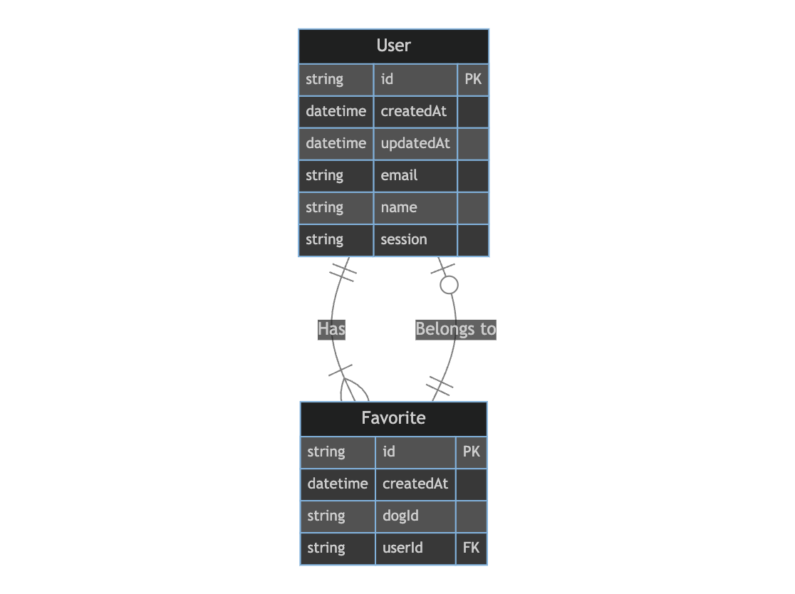

# **WRITEUP.md**

**Table of Contents**

1. [Build Instructions](#build-instructions)
2. [Design Choices](#design-choices)
3. [Challenges](#challenges-issues-encountered)
4. [Workarounds](#workarounds)
5. [Diagrams: E-R, App Router Flowchart](#diagrams)
6. [TODOs](#todos)
7. [Troubleshooting](#troubleshooting)

## **Build Instructions <a name="build-and-usage-instructions"></a>**

### **Getting Started with the Dog Matching App**

### 1. Install Dependencies

Make sure you have [Node.js](https://nodejs.org/en/download) (v18.7+) installed on your machine. Then, proceed to install the project dependencies by running the following command:

```bash
npm install
```

Before running the app, you'll need to set up a few configuration files:

- **`.env.local`**: This file contains Next.js-specific environment variables.
- **`.env`**: Prisma relies on this file to access the database URL.
- **`.env.template` (provided)**: Contains variables needed for both **`.env.local`** and **`.env`**.

Create duplicate copies of **`.env.template`** and name them **`.env.local`** and **`.env`**. Fill in the required information in these files.

#### .env.local

```bash
NEXT_PUBLIC_ORIGIN = "http://localhost:3000"
NEXT_PUBLIC_FETCH_COOKIE_NAME=<FOUND IN EXERCISE INSTRUCTIONS>
NEXT_PUBLIC_FETCH_API_URL=<FOUND IN EXERCISE INSTRUCTIONS>
```

#### .env

```bash
DATABASE_URL=
```

### 2. Setting Up the Database

You have two options for setting up the database:

1. [Local DB Setup with Docker (recommended)](#local-setup-with-docker)
2. [Cloud DB Setup](#cloud-db-setup)

#### [1] Local Setup with Docker <a name="local-setup-with-docker"></a>

- Start by installing Docker Desktop (macOS/windows) or Docker Engine (Linux). [Install Docker](https://www.docker.com/get-started/)

- Run the following command in a new terminal to initialize the Docker container with a MySQL database:

**macOS/Linux**

```bash
  npm run db:init
```

**Windows**

```bash
  npm run db:init-win
```

Now, you have a MySQL database running in a Docker container with the following credentials:

- Database name: fetch_take_home_db
- Database password: password
- Port exposed: 3306

Replace the **`DATABASE_URL`** in **`.env`** with the URL provided by Docker.

```bash
# the default URL is found in .env.template
DATABASE_URL=
```

To connect to the database with Prisma, run the following command in a new terminal:

**macOS/Linux**

```bash
  npm run prisma:init
```

**Windows**

```bash
  npm run prisma:init-win
```

#### [2] Setup with a Cloud Provider <a name="cloud-db-setup"></a>

You can also run the app locally with a MySQL database provided by a cloud service like [PlanetScale](https://planetscale.com/docs/tutorials/planetscale-quick-start-guide) or [Railway](https://docs.railway.app/databases/mysql).

Replace the **`DATABASE_URL`** in **`.env`** with the URL provided by the cloud provider.

```bash
DATABASE_URL=<mysql://{MYSQL_DB_USER}:{MYSQL_DB_PASSWORD}@{MY_SQL_DB_HOST}:{PORT}/{MYSQL_DB_NAME}>
```

**macOS/Linux**

```bash
  npm run prisma:init
```

**Windows**

```bash
  npm run prisma:init-win
```

### 3. Running the App

You're now ready to run the app:

```bash
npm run dev
```

The app will be accessible at [http://localhost:3000](http://localhost:3000/) in your web browser.

---

## **Design Choices** <a name="design-choices"></a>

The following design choices were made for the Dog Matching App:

- [Architectural Decisions](#architectural-decisions)
- [UI Library](#ui-library)
- [Database](#database)
- [Deployment](#deployment)

### **Architectural Decisions**

- **Next.js 13**: The application is built using Next.js 13, chosen for its new app router, built-in server-side rendering and static site generation, built-in routing and file-based routing, route grouping, support for React Server Components, and built-in loading and error states.
  - _Alternative Considered_: The alternative to Next.js could have been using Create React App (CRA) with React Router for routing. However, Next.js was preferred due to its built-in support for server-side rendering and static site generation, which significantly improves performance.
- **Server-Side Data Fetching**: The app utilizes server-side data fetching and caching with Next.js server actions, which enhances performance and responsiveness by pushing as much HTML to the client before interactivity is needed.
  - _Alternative Considered_: Client-side data fetching with libraries like Axios or GraphQL was considered, but server-side data fetching was chosen to improve the app's SEO and overall performance by reducing js bundle size since layouts and non interactive components could now be sent as HTML to the user as server components.
- **Persisting Data**: A database was used to persist data of the user and favorite.
  - _Alternative Considered_: Considering the app's size, a JSON file could have been used to store the data. However, a database was chosen to ensure data integrity and to allow for future expansion. Also local storage was considered, but it was not chosen because it would not allow for the data to be shared across devices.

### **UI Library**

- **Shadcn UI**: Shadcn UI was selected as the UI library for its seamless integration with Next.js 13 and Tailwind CSS. It's not a component library so the components are not opinionated and can be styled with Tailwind CSS.
  - _Alternative Considered_: An alternative UI library could have been Material-UI. However, Shadcn UI was preferred because it was designed with Next.js 13 in mind, making integration smoother. Material-UI is built on top of Emotion which was causing issues with Next.js 13 at the time of development.

### **Database**

- **MySQL**: MySQL is used as the database system, providing a reliable and widely-supported data storage solution.
  - _Alternative Considered_: PostgreSQL is another powerful and open-source relational database system that could have been chosen. MySQL was selected based on its ease of use and compatibility with PlanetScale.
- **Prisma ORM**: Prisma serves as the ORM, ensuring a well-structured and efficient data interaction layer. The Prisma ORM allows for clear relationships between users and their favorite items, simplifying data management and retrieval.
  - _Alternative Considered_: An alternative could have been writing custom SQL queries for data interaction instead of using an ORM. However, Prisma was chosen to benefit from its type safety and query generation capabilities.
- **PlanetScale**: The app's database is hosted on PlanetScale for ease of use and integration with Prisma.
  - _Alternative Considered_: Other cloud providers like AWS RDS or Google Cloud SQL could have been chosen. However, PlanetScale was selected for its cost and integration with Prisma.

### **Deployment**

- **Vercel**: The app is deployed on Vercel, a cloud platform known for its ease of use and tight integration with Next.js. This choice simplifies the deployment process and ensures reliable hosting.
  - _Alternative Considered_: An alternative deployment option could have been using AWS Elastic Beanstalk for more control over the deployment environment. However, Vercel was selected for its cost and seamless integration.

## **Challenges Encountered and Resolutions <a name="challenges-issues-encountered"></a>**

During the development of the Dog Matching App, several challenges surfaced, demanding innovative solutions:

### **Authentication Challenges**

The application required user credentials for user creation in the database. As a result, the fetch operation for Fetch's auth endpoint had to be executed server-side, involving the use of sign-in credentials for database storage. However, this presented certain complexities:

- The authentication token is an httpOnly cookie designed to reside in the user's browser, not on the app's server. Consequently, the response from Fetch's auth endpoint delivered a cookie in the headers, necessitating manual extraction [line 34](https://github.com/rcervant/fetch-take-home/blob/main/actions/signIn.ts). This cookie was then dispatched to the user's browser. The session details were also stored in the database for each user and used in each subsequent fetch operation with Fetch's API in the request headers under `cookie`.
- Next.js incorporates an assertive caching policy, leading to the caching of fetch calls, inhibiting new requests when required. While this enhances performance for static data, it often resulted in a stale user session. To mitigate this, caching was forcefully disabled during each sign-in to circumvent the use of outdated session data.

### **Transition to Infinite Scrolling**

In a previous iteration of the application, page navigation buttons labeled `prev` and `next` were employed to append the `prev` and `next` URLs from the server's response to the router stack. This approach, while simpler, mandated a complete page refresh to retrieve the next page's data. This resulted in a suboptimal user experience, as it required multiple clicks on the browser's back button and waiting for the dogs to load. Consequently, a transition to Infinite scrolling was initiated. This transformation introduced specific challenges:

- Initially, the dogs for the first page were fetched server-side, but subsequent pages relied on client-side fetching. This divergence raised peculiarities when making calls from the client. Most notably, the logic for handling API data was primarily developed server-side. To maintain consistency and avoid duplicating logic on the client, Next.js 13 server actions were employed. The challenge was further intensified as the logic for constructing requests to Fetch's API for dog retrieval was previously managed within the [SearchPage](<https://github.com/rcervant/fetch-take-home/blob/main/app/(main)/dogs/search/page.tsx>) server component. This added complexity when making client fetches, as search parameters were no longer automatically parsed. A callback was required to manually adapt the search parameters to the server action's structure. This approach allowed fetch calls to be seamlessly chained from client to server for retrieving the next page's data, mirroring the process used for the initial server-side retrieval.
- Triggering the next page's data retrieval necessitated the utilization of a reference (ref) to the last element on the page. The ref was instrumental in identifying when the user scrolled to the page's bottom, prompting the retrieval of the next page's data. This functionality was implemented by harnessing the IntersectionObserver API. This method ensured that the ref would be monitored, and the retrieval of the next page's data would be triggered once the ref became visible. This approach considerably improved the user experience, as the next page's data was fetched before the user reached the page's bottom. Nevertheless, this method introduced complexities, as the ref needed to be visible to initiate the fetch. This risked continuous calls to the API while the ref was visible. To address this, a [debouncing](https://github.com/rcervant/fetch-take-home/blob/main/lib/client/utils.ts) mechanism was implemented for the `loadMoreDogs` function. Additionally, the `useEffect` hook was leveraged to return a cleanup function that cleared the ref when the component was unmounted.

### **Challenges in Form Validation**

The implementation of form validation within Shadcn UI dialog components posed its own set of challenges:

- Shadcn UI dialog components encountered issues when integrated with forms from React Hook Form as children within dialog components. To circumvent these limitations, components that were typically standalone were redefined inline within the dialog. This approach was imperative in addressing the issue, as observed in a similar GitHub [issue](https://github.com/shadcn-ui/ui/issues/709).
  - The trade-off was an expansion of component length ([SignInForm](https://github.com/rcervant/fetch-take-home/blob/main/components/SignInForm.tsx), [SearchDialog](https://github.com/rcervant/fetch-take-home/blob/main/components/dogSearchModal/SearchDialog.tsx)). This decision was made to ensure meticulous form validation and error handling. The alternative was to allow form submission without validation. The chosen approach prioritized user experience over modularity in the components.

## **Effective Workarounds <a name="circumvented-instructions"></a>**

To address the challenges encountered during the development of the Dog Matching App, the following workarounds were diligently implemented:

- Manual parsing and configuration of the http auth cookie.
- Manual parsing of search parameters in the `next` property of the API response to align with the structure of the server action.

## **Diagrams: <a name="diagrams"></a>**

### **App Router Flowchart:**



The app router flowchart provides an overview of the app's system architecture, including how data flows between various components and services.

### **ER Diagram:**



The Entity-Relationship (ER) diagram illustrates the database schema for the Dog Matching App. It depicts the relationships between entities, users and favorites, and their respective attributes.

### **Entities:**

`User`:

- id: A unique identifier for the user.
- createdAt: A timestamp for when the user was created.
- updatedAt: A timestamp for when the user was last updated.
- email: The email address of the user, and it has a uniqueness constraint.
- name: The name of the user.
- session: the current cookie on the clients browser (needed for credentials in fetch).

`Favorite`:

- id: A unique identifier for the favorite item.
- createdAt: A timestamp for when the favorite was created.
- dogId: A field that stores the identifier of the favorited dog.
- userId: A reference to the user who added the favorite, establishing a relationship with the User entity. This is a foreign key field.

`Relationships`:
There is a one-to-many relationship between the User and Favorite entities, where one user can have multiple favorite items. This relationship is represented by the favorites field in the User model and the user field in the Favorite model. The foreign key userId in the Favorite model connects each favorite item to a specific user.

`Indexes and Constraints`:
There is a uniqueness constraint on the combination of dogId and userId in the Favorite entity. This constraint ensures that a user can have a favorite for a particular dog only once.

## **TODOs: Areas for Future Development and Production Enhancements <a name="todos"></a>**

While the Dog Matching App is currently fully functional, there are areas where future improvements can be explored:

### **Location-Based Search Functionality**

Presently, the app solely facilitates dog searches by breed and age. To elevate the user experience, extending the app's capabilities to support location-based searches is being considered. This expansion could encompass searching within a user-specified radius of a designated zipcode or by city and state.

### **Enhanced User Experience for Favorites Management**

There is presently a noticeable delay due to network latency when adding a dog to one's favorites. To enrich the user experience, evaluating the adoption of the experimental useOptimistic hook is being looked into. This feature would enable the immediate display that a dog has been favorited, with updates occurring as soon as the server provides the finalized favorites.

### **Augmented Testing Regimen**

To guarantee the resilience and reliability of the application, the incorporation of additional testing procedures is needed. Expanding the scope of testing coverage would facilitate the identification and resolution of potential issues.

### **Heightened Observability and Logging**

For improved monitoring and issue identification, implementation of expanded logging is being explored. This initiative would permit the timely detection of potential issues and bottlenecks, leading to a more robust and responsive application.

### **Elevating User Experience through A/B Testing**

To refine the app's user experience, the introduction of A/B testing methodologies is a valuable consideration. This approach empowers the comparison of distinct app versions to ascertain which iteration delivers superior performance. These can be performed in `middleware.ts` and reside on Vercel's edge network.

## **Troubleshooting <a name="troubleshooting"></a>**

If you encounter any issues while running the app, consider the following troubleshooting steps:

### **Node.js and Docker Versions**

Ensure that you have the correct versions of Node.js and Docker installed on your machine:

- Node.js: A minimum version of 18.7 is required.
- Docker: Make sure you have the latest version of Docker installed. If you're using macOS or Windows, ensure you have Docker Desktop installed. For Linux users, make sure you have Docker Engine installed.

### **Local Database Setup with Docker**

During the local database setup with Docker, the app runs a script that checks if the Docker daemon is running. If it's not, the script starts it in the background. Once Docker is up and running, the following command is executed to create a Docker container named **`fetch_take_home_db`**:

```bash
docker run --name fetch_take_home_db -p 3306:3306 -e MYSQL_ROOT_PASSWORD=password -v ./scripts/init.sql:/docker-entrypoint-initdb.d/init.sql mysql
```

This command is used to create a Docker container, expose port 3306, set the root password to 'password', and execute the **`init.sql`** script to create at least one table in the database for Prisma to connect to.

If you encounter issues with this command, try the following steps:

1. **Docker Installation**: Ensure that Docker is properly installed on your machine, and it is running.
2. **Stop Existing Container**: If a Docker container with the name **`fetch_take_home_db`** is already running, stop it using the following command:

   ```bash
   docker stop fetch_take_home_db
   ```

3. **Remove Existing Container**: If the container is not running, you can remove it with the following command:

   ```bash
   docker rm fetch_take_home_db
   ```

4. **Port Conflict**: In case port 3306 is already in use, you can change the port mapping in the **`docker run`** command to use a different port, such as 3307:

   ```bash
   docker run --name fetch_take_home_db -p 3307:3306 -e MYSQL_ROOT_PASSWORD=password -v ./scripts/init.sql:/docker-entrypoint-initdb.d/init.sql mysql
   ```

### **Troubleshooting App Issues**

In the event that you encounter issues while using the app, we recommend following these troubleshooting steps:

- **Node.js and Next.js**: Ensure that you have Node.js version 18.7 installed on your machine, along with the latest Next.js version (13.5 at the time of writing).
- **Development Mode**: To identify any potential problems, run the app in development mode and check for error messages in the console.
- **Restart**: Attempt to resolve the issue by restarting the application.
- **Clear Browser Cache and Cookies**: Resolving problems related to stale auth cookies can often be achieved by clearing your browser's cache and cookies.
- **Clear Next Cache**: To address potential issues stemming from stale data, clear your Next.js cache stored in the `.next/` directory.
- **Use an Alternate Browser**: If the issue persists, consider switching to a different web browser.
- **Using Incognito Mode**: Please note that the app relies on an authentication cookie placed in the browser to verify the user. **`Incognito mode DOES NOT save this cookie`**, rendering the app inoperative in such a mode.

### **Reporting Bugs**

Should you continue to face difficulties, you are encouraged to consider [reporting a bug](https://github.com/rcervant/fetch-take-home/issues). When submitting a bug report, kindly include the following information:

- A comprehensive description of the issue you are encountering.
- Detailed steps to reproduce the problem.
- Information regarding the versions you are using:
  - Node.js version.
  - Next.js version.
  - Docker version.

By furnishing this data, you will significantly contribute to the identification and resolution of any potential issues.

## Conclusion

The Dog Matching App is a fully functional application that allows users to search for dogs by breed and age, and add them to their favorites. The app is built with Next.js 13, Shadcn UI, and Prisma ORM. It is deployed on Vercel and uses a MySQL database hosted on PlanetScale. The app is fully responsive and supports infinite scrolling. It also supports server-side data fetching and caching with Next.js. It can be further improved by adding location-based searching, favorites, pagination, and testing.

Your time and commitment to understanding the application's inner workings is greatly appreciated.
